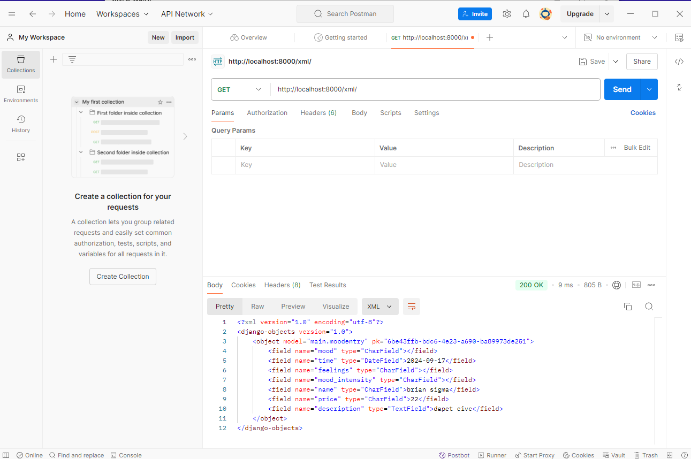
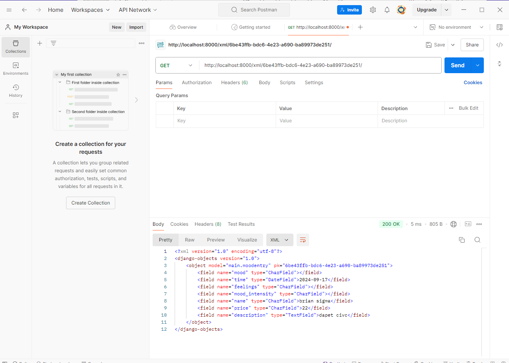
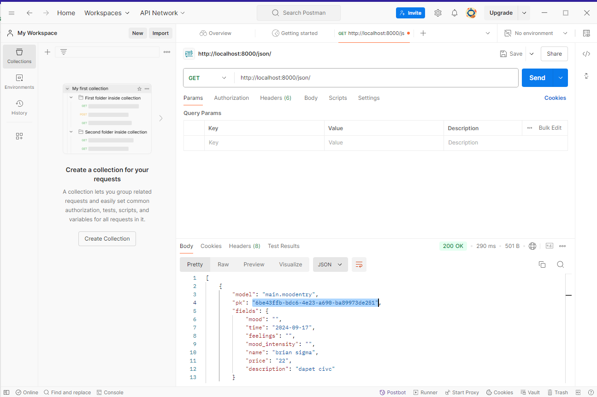
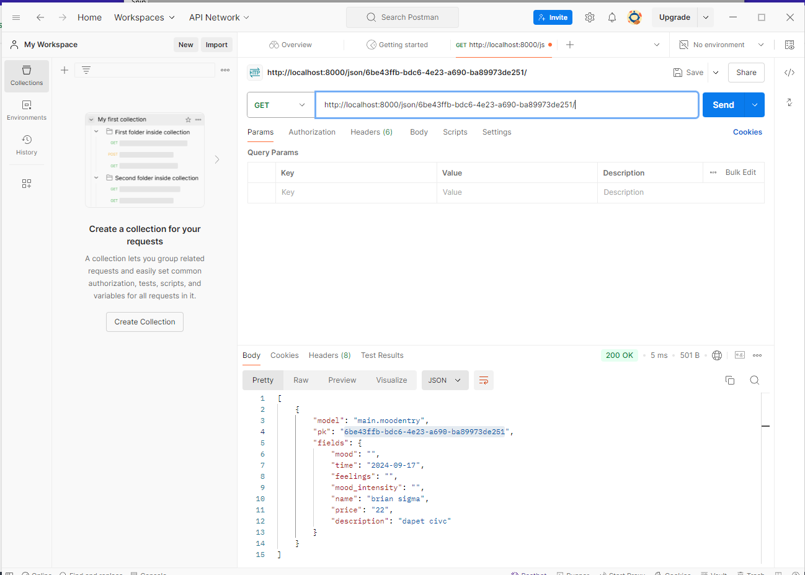

## KANGZEN STORE

## LINK : hafizh-surya-kangzenstore.pbp.cs.ui.ac.id

## ASSIGNMENT 2
1. Explain how you implemented the checklist above step-by-step (not just following the tutorial).

Project Setup: Initiated a new Django project by running django-admin startproject mysite.
App Creation: Created a new application within the project using python manage.py startapp myapp.
Database Configuration: Configured settings.py to connect to a PostgreSQL database for production and SQLite for development.
Model Development: Defined models in models.py to represent the data structures needed for the application.
Admin Interface: Registered models with the Django admin site to make them accessible through the Django admin interface.
View Logic: Implemented view functions in views.py that handle different routes' logic and data processing.
URL Mapping: Set up URL configurations in urls.py to route requests to the appropriate views.
Templates: Created HTML templates to render data sent from views.
Testing and Debugging: Wrote tests for views and models and used Django's debugging tools to ensure everything works as expected.
Deployment: Deployed the application on a cloud platform, setting up environment variables and ensuring security settings.

2. Explain the use of git in software development!

Git is a tool that helps us keep track of changes in the project. It's like a history book that lets us see past changes, try out new ideas without messing up the main project, and work with others easily. It's very important for making sure everything goes smoothly and safely when many people are working together.

3. In your opinion, out of all the frameworks available, why is Django used as the starting point for learning software development?

Django is great for beginners because it has everything you need to build a website all in one place. It’s also well-explained through lots of guides and has a big group of people who can help you learn and solve problems. This makes it easier to start building websites quickly.

4. Why is the Django model called an ORM?

ORM stands for Object-Relational Mapping. In Django, it means you can work with the database using Python code instead of having to write complicated database queries. This makes it safer and easier to get data in and out of the database.

## ASSIGNMENT 3

1. Explain why we need data delivery in implementing a platform.

When a user requests information, the platform processes the data, or synchronizes with other services, data delivery is essential to the platform's functionality since it makes sure that everything functions together. When data isn't transmitted correctly, the platform feels sluggish, unstable, or even malfunctioning. Transporting data from one location to another is not as simple as it seems; it also needs to be done quickly and accurately to provide users with a flawless experience.

2. In your opinion, which is better, XML or JSON? Why is JSON more popular than XML?

For the most part, I believe that JSON is superior to XML in most circumstances. JSON is simpler to write, easier on the eyes, and works flawlessly with JavaScript, which is widely used these days. Despite its strength, XML seems cumbersome and excessively intricate for numerous things that JSON accomplishes more efficiently and rapidly. The main factor behind JSON's popularity in web development is how simple it is to use, particularly when interacting with APIs. Most developers like it since it completes the task more quickly and efficiently.

3. Explain the functional usage of is_valid() method in Django forms. Also explain why we need the method in forms?

In Django forms, the is_valid() method acts as a kind of data checkpoint, ensuring that everything is in order before continuing. Its purpose is to guarantee that only clean, useable data is handled and that user-submitted data passes the required validation checks. Without it, you run the danger of mistakes or even security problems brought on by corrupt or malicious data. It's important to preserve the integrity of your app and make sure that interactions run well for all parties involved, not only to abide by the regulations.

4. Why do we need csrf_token when creating a form in Django? What could happen if we did not use csrf_token on a Django form? How could this be leveraged by an attacker?

It is essential to utilize csrf_token in Django forms as it provides an extra security layer that guards against malicious attacks, particularly CSRF assaults. Without it, attackers may readily fool users into carrying out undesired tasks, such as modifying account settings or completing transactions, without their knowledge. Although it's a straightforward token, without it, hackers might take advantage of user confidence and tamper with important data on your app. Therefore, it's a minor but essential component of protection that you shouldn't ignore.

5. Explain how you implemented the checklist above step-by-step (not just following the tutorial).

I start by making a new file called form.py that contains the fields and the model. I then produced the four views that the assignment asked for. I then make the base.html, create_product_entry.html, and update the main.html. After doing all of this, I routed every view in the urls.py file. Finally, I changed the settings.py templates so that I could add products using the online form.

## POSTMAN RESULTS

### XML

### XML ID

### JSON

### JSON ID

## ASSIGNMENT 4

1. What is the difference between HttpResponseRedirect() and redirect()?

In Django, both HttpResponseRedirect() and redirect() are used for redirects, but they differ in how easy they are to use. HttpResponseRedirect() is a more basic function that requires you to provide the full URL or path where you want to send the user. It's useful when you need more control, but you have to manually handle the URL.

On the other hand, redirect() is more flexible and easier to use. It can take a full URL, a path, a view name, or even a model instance. This makes it simpler, especially when you’re redirecting to a view or object without needing to build the URL yourself. While both do the same job, redirect() is more convenient for most situations.

2. Explain how the MoodEntry model is linked with User!

The MoodEntry model can be associated with the User model through a ForeignKey field, creating a one-to-many relationship where each mood entry is tied to a specific user. For example, using ForeignKey(User, on_delete=models.CASCADE) connects each mood entry to a user, and if that user is deleted, their related mood entries are automatically removed as well.

3. What is the difference between authentication and authorization, and what happens when a user logs in? Explain how Django implements these two concepts.

Authentication verifies a user's identity by checking credentials like a username and password, answering "Who are you?" Authorization comes after and determines what actions or resources a user can access, answering "What can you do?"

When a user logs in, Django's auth framework handles authentication by checking the credentials and creating a session for the user. After authentication, Django uses a permissions system for authorization, determining what the user is allowed to do based on their permissions or group memberships. In short, authentication identifies the user, and authorization controls their access.

4. How does Django remember logged-in users? Explain other uses of cookies and whether all cookies are safe to use.

Django remembers logged-in users by using cookies. When a user logs in successfully, Django creates a session and sends a cookie to the user's browser. This cookie contains a session ID, which Django uses to link the user to their session data stored on the server. With each subsequent request, the browser sends the cookie back to the server, allowing Django to retrieve the session data and identify the user as logged in.

Cookies have various other uses beyond managing sessions. They can store user preferences, track site visits, or enable personalized experiences, such as remembering items in a shopping cart or maintaining language settings across visits.

However, not all cookies are equally safe. Cookies can be vulnerable to security risks, like cross-site scripting (XSS) or cross-site request forgery (CSRF) attacks. To enhance security, Django provides features like HttpOnly cookies (which prevent JavaScript access) and Secure cookies (which are only sent over HTTPS connections). Proper cookie management and implementing these protections help mitigate potential risks.

In summary, Django uses cookies to manage logged-in users by storing a session ID. While cookies serve many purposes, it's essential to implement security measures to ensure they are safe.

5. Explain how did you implement the checklist step-by-step (apart from following the tutorial).

I began by developing functions for user registration, login, and logout in the views.py file and then connected these functions to the appropriate paths in urls.py. After that, I created the templates register.html and login.html to provide the user interface for registration and login. For the logout feature, I added a button in main.html to allow users to log out easily.

Once the functions were complete, I created two user accounts, each with three associated data entries, and ensured this data could be accessed locally. I used user = models.ForeignKey(User, on_delete=models.CASCADE) in the model to link the data to the respective user.

Additionally, I implemented cookies to track user activity, specifically the last login time. I modified the show_main, login_user, and logout_user views to manage this functionality. The last login time is stored in a cookie and displayed in main.html. I set the cookie when the user logs in and handled its expiration when the user logs out.